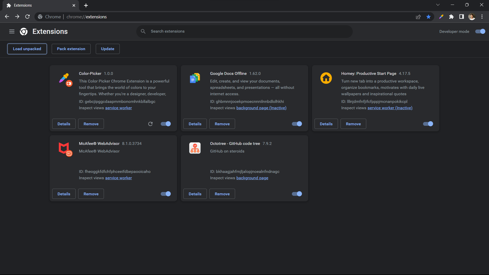

# Color-Picker chrome-extension

### 📌 Introduction

This Color Picker Chrome Extension is a powerful tool that brings the world of colors to your fingertips. Whether you're a designer, developer, or simply someone who appreciates aesthetics, this extension is designed to enhance your color selection process and streamline your workflow.With our Color Picker Extension, you can easily and accurately capture colors from any web page with just a click.

### 🛠️ Installation Steps

Star and Fork the Repo 🌟 and this will keep us motivated.

1. Clone the repository

```bash
git clone https://github.com/adityaK87/chrome-extension/
```

2. Change the working directory

```bash
cd chrome-extension
```

3. Install dependencies

```bash
npm install
```

4. Create Build Using

```bash
npm run build
```

5. `dist` folder has been created using this Above command
   

6. Go to Chrome and type `chrome://extensions`
   

7. Switch On the Devloper mode
   

8. click on the `Load Unpacked` Button

 

8. Uplaod your `/dist` folder here which was created by command `npm run build`
   

### Screenshots


